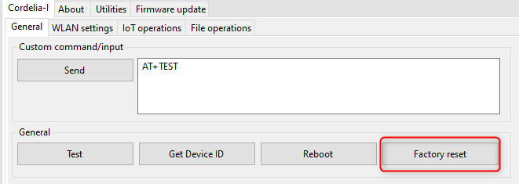
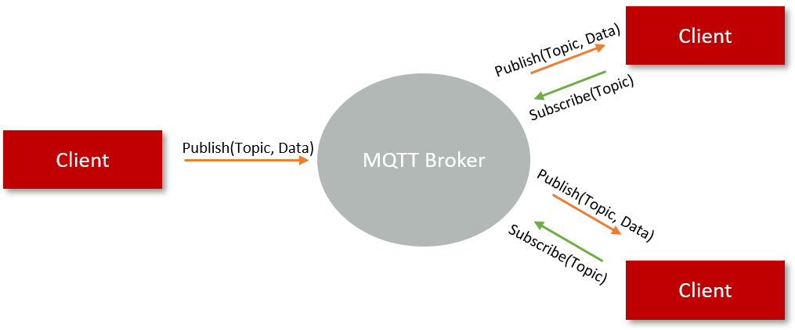
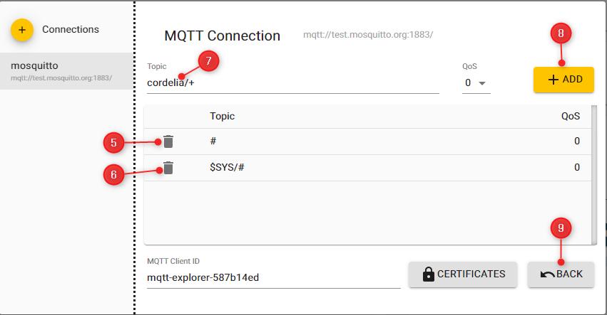
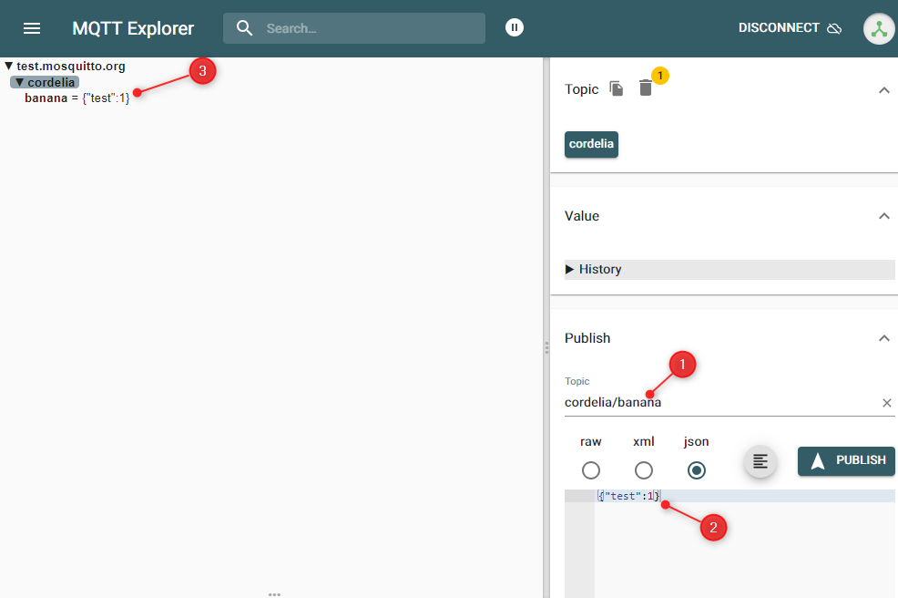
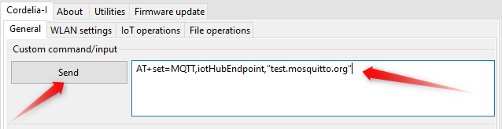
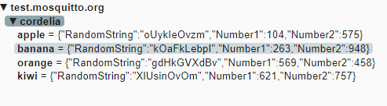

# **Exercise 2**: Hands-on with MQTT protocol (without security)

> [!WARNING]  
> **The MQTT server used here is public and data sent will be publicly accessible. Be aware of the data you share.**

> [!IMPORTANT]  
> Perform a "Factory Reset". Please note that the reset will typically take 60 seconds. Please wait for at least this time. The PC tool will not show any reaction during that duration, please be patient. Do not power-off or hard reset the EV-board during this time.
>
> 

The aim of this exercise is to get hands-on with the MQTT protocol by connecting Cordelia-I module to a public MQTT server without any encryption or authentication.

## MQTT
MQTT - Message Queuing Telemetry Transport is a lightweight application layer protocol based on a publish/subscribe messaging mechanism. This protocol was designed for resource constrained and unreliable networks with limited bandwidth and high latency. These characteristics make MQTT suitable for low-power, low-bandwidth IoT applications. Inherently, the MQTT protocol offers some degree of assurance of delivery thereby offering the robustness necessary for industrial machine-to-machine communication.

MQTT was originally developed by IBM and the version 3.1.1 is an OASIS standard that is open and royalty-free. It is based on client-server architecture where every client connects
to a server (broker) over TCP resulting in a star topology. Once connected, the clients send and receive messages using the publish/subscribe mechanism.

Data transfer in MQTT takes place based on publish/subscribe mechanism. The clients connected to the broker can publish messages under certain topics. The clients can also subscribe to topics that are of interest to them. When a client publishes a message on a topic, the broker forwards the message to any client that has subscribed to the topic. This mechanism enables bi-directional communication with an extremely low overhead (2-byte header).




## MQTT server/broker

For this hands-on exercise, we will use a publicly available version of the [**Eclipse Mosquitto**](https://mosquitto.org/) MQTT server/broker. [This server](https://test.mosquitto.org/) is provided as a service for the community to do testing, but it is also extremely useful for testing.

## MQTT client

For this exercise, we will use [**MQTT explorer tool**](https://mqtt-explorer.com/) as the client. MQTT Explorer is a comprehensive MQTT client that provides a structured overview of your MQTT topics and makes working with devices/services on your broker dead-simple. Follow the instructions [here](https://mqtt-explorer.com/) to install this tool.


## Connect the MQTT explorer client to public Mosquitto broker

In this step, we will connect to the Mosquitto broker over TCP. In this case the connection is neither mutually authenticated nor encrypted.

Open the MQTT explorer tool. In the start-up page add the parameters of the MQTT broker/server.

1. Click on the "+ connections" button.
2. Give a unique name to this connection. For example, "mosquitto".
3. Enter the host name. This is the address of the MQTT broker/server "test.mosquitto.org"
4. Click on advance button.
In the advanced view,
5. Delete the default topic "#" in order to prevent receiving all messages published to this public server.
6. Delete the default topic "$SYS/#"
7. Type in a new topic name "cordelia/+". 
8. Click on add to subscribe to this topic by default on successful connection.
9. Click on "BACK" button to return to the default view.
10. Finally, click on the "CONNECT" button to connect to the broker.




You can now test the connection by publishing the data to a topic that this client has subscribed to. To do this, in the data view,

1. Type in the name of the topic. It should start with the prefix "cordelia/". For example, "cordelia/banana".
2. Type in the payload. Let us use a JSON formatted payload. For example, ``` {"test": 8} ```
3. You should be able to see the data you published in the received list



Congratulations! You have now sent your first MQTT packet.

## Configure the Cordelia-I to connect to public Mosquitto broker

In this step, we configure the Cordelia-I module to connect to the public Mosquitto Broker and send/receive data.
The on-board MQTT client on the Cordelia-I module needs to be configured. These parameters are stored in the "user settings" of the module. In the WE UART terminal, use the "Custom command/input" section in the "General" tab to configure the user settings.

:bulb: You could use the "Set up module with dummy parameters" button. This will configure all the user settings and all the parameters necessary for this connection.

```
-> AT+set=MQTT,iotHubEndpoint,"test.mosquitto.org"
<- OK
-> AT+set=MQTT,iotHubPort,1883
<- OK
-> AT+set=MQTT,flags,"url"
<- OK
-> AT+set=MQTT,clientId,"your_client_id"
<- OK
-> AT+set=SUBTOPIC0,name,"cordelia/+"
<- OK
-> AT+set=PUBTOPIC0,name,"cordelia/apple"
<- OK
```

You could configure additional topics to publish,
```
-> AT+set=PUBTOPIC1,name,"cordelia/banana"
<- OK
-> AT+set=PUBTOPIC2,name,"cordelia/orange"
<- OK
-> AT+set=PUBTOPIC3,name,"cordelia/kiwi"
<- OK
```



## Connect to the broker and exchange data

At this stage make sure that you are connected to the WiFi. If not connected, follow the steps [here](exercise1.md\#connect-cordelia-i-module-to-your-wifi-network).

Now that the module is configured, Go to the "IoT Operations" tab and click on "Connect" button. On successful connection, you will the module will generate a "CONNACK" event.


```
-> AT+iotconnect
<- OK
<- +eventmqtt:info,"CONNACK",0

```

To exchange data, use the "Publish data" section in the "IoT Operations" tab. Here type in the payload in the text box and click on "Publish custom payload" button to send the data.
Alternatively, use the "Generate and publish random payload" button to send random data.


```
-> AT+iotpublish=0,"{"RandomString":"oUykIeOvzm","Number1":104,"Number2":575}"
<- OK
<- +eventmqtt:recv,cordelia/apple,qos0,"{"RandomString":"oUykIeOvzm","Number1":104,"Number2":575}"

```


Since we publish to the same topic, you should be able to see the data on the MQTT explorer client. 



Congratulations on completing this exercise!

[ :arrow_backward: ](README.md) Back to [homepage](README.md)
