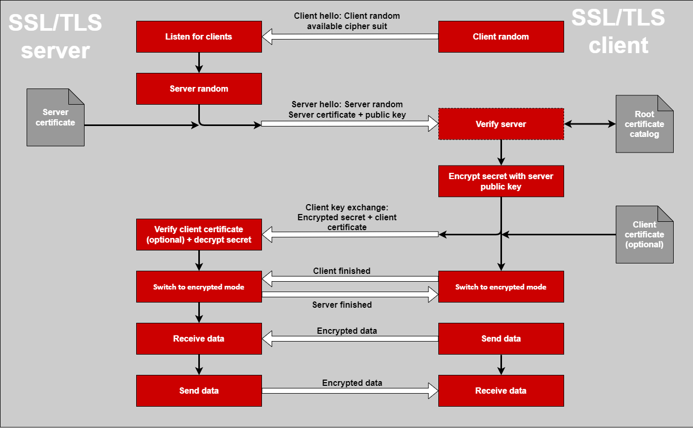
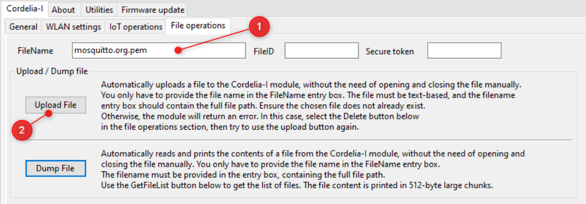

# **Exercise 3**: MQTT over TLS

So far we have used MQTT over TCP to exchange messages. However, TCP does not provide any security for data exchange. The aim of this exercise is to create the first MQTT connection over TLS.


> [!IMPORTANT]  
> Perform a "Factory Reset". Please note that the reset will typically take 60 seconds. Please wait for at least this time. The PC tool will not show any reaction during that duration, please be patient. Do not power-off or hard reset the EV-board during this time.
>
> 


## TLS
Transport Layer Security (TLS) is a cryptographic protocol designed to provide communications security over a computer network, such as the Internet. The TLS protocol aims primarily to provide security, including privacy (confidentiality), integrity, and authenticity through the use of cryptography, such as the use of certificates, between two or more communicating entities.

The protocol defines the exchange of a sequence of messages over an existing TCP connection resulting in a authenticated and encrypted connection that ensures data integrity.



## Digital certificates

In cryptography, a public key certificate, also known as a digital certificate or identity certificate, is an electronic document used to prove the validity of a public key. The certificate includes the public key and information about it, information about the identity of its owner (called the subject), and the digital signature of an entity that has verified the certificate's contents (called the issuer).

In a typical public-key infrastructure (PKI) scheme, the certificate issuer is a certificate authority (CA), usually a company that charges customers a fee to issue certificates for them.


## Digital certificates and keys in TLS

In order to create TLS connection the client and the server require a set of cryptographic assets. These assets are used during the handshake process to establish a secure connection.

### **Assets at the server**

**Server certificate** : This is a digital certificate that proves the identity of the server and is usually issued by a certificate authority (CA).

### **Assets at the client**

**Client key** : This is a private key that uniquely identifies the client.

**Client certificate** :  This is a digital certificate that proves the identity of the client that contains the public key corresponding to the client key.

**Root CA certificate** : This is the top most certificate  in the server certificate chain used to verify the server. Typically, clients have a catalog of trusted root CA that enable server verification.


## MQTT server/broker

For this hands-on exercise, we will use a publicly available version of the [**Eclipse Mosquitto**](https://mosquitto.org/) MQTT server/broker. [This server](https://test.mosquitto.org/) is provided as a service for the community to do testing, but it is also extremely useful for testing.


## MQTT client

In this example, we will use the Cordelia-I EV board as the MQTT client.

## Encrypted connection

The public Mosquitto broker offers a encrypted connection on the port 8883. In this exercise, we will use TLS with server verification only. This means that the Cordelia-I client will authenticate the Mosquitto server. However, the Mosquitto broker will skip the client verification step. A session key is exchanged and the data connection will be encrypted.

Since we do not perform client authentication, client certificate and key will not be required for this example.

You will however need a server certificate to perform server authentication. Please download the same from [here](https://test.mosquitto.org/ssl/mosquitto.org.crt).


## Upload server certificate to Cordelia

In this step, we will upload the mosquitto server certificate (download from [here](https://test.mosquitto.org/ssl/mosquitto.org.crt)) to the Cordelia-I's file system. This file will be used by the on-board MQTT client during the connection set up.

In order to upload the file, in the "File operations" tab on the WE UART terminal, 
1. Type in "mosquitto.org.pem" in the "FileName" text box.
2. Type in "4096" in the "Size(bytes)" field.
3. Check the "Write" and "Create" check boxes in the Mode.
4. Click on "Open". Cordelia will generate a file ID which will be copied automatically to the FileID text box.
5. Now click-on the "WriteFile" button. This will open a file browser. Browse to the location where the downloaded server file was saved. Select the file and click on "Open". The file will be written to the module's file system.
6. Finally, click on close button to close the file.
 



```
-> AT+FileOpen=mosquitto.org.pem,WRITE|CREATE,4096
<- +fileopen:363990529,0
<- OK

-> AT+FileWrite=363990529,0,0,1452, <Content to write>
<-+filewrite:1452
<-OK

<-AT+FileClose=363990529,,
<-OK

```


## Configure the Cordelia-I module

In this step, we configure the Cordelia-I module to connect to the public Mosquitto Broker and send/receive data.
The on-board MQTT client on the Cordelia-I module needs to be configured. These parameters are stored in the "user settings" of the module. In the WE UART terminal, use the "Custom command/input" section in the "General" tab to configure the user settings.

```
-> AT+set=MQTT,iotHubEndpoint,"test.mosquitto.org"
<- OK
-> AT+set=MQTT,iotHubPort,8883
<- OK
-> AT+set=MQTT,flags,"url|sec|whitelist_rootca"
<- OK
-> AT+set=MQTT,clientId,"your_client_id"
<- OK
-> AT+set=MQTT,rootCAPath,"mosquitto.org.pem"
<- OK
-> AT+set=SUBTOPIC0,name,"cordelia/+"
<- OK
-> AT+set=PUBTOPIC0,name,"cordelia/apple"
<- OK
```

You could configure additional topics to publish,
```
-> AT+set=PUBTOPIC1,name,"cordelia/banana"
<- OK
-> AT+set=PUBTOPIC2,name,"cordelia/orange"
<- OK
-> AT+set=PUBTOPIC3,name,"cordelia/kiwi"
<- OK
```


## Connect to the broker and exchange data

At this stage make sure that you are connected to the WiFi. If not connected, follow the steps [here](exercise1.md\#connect-cordelia-i-module-to-your-wifi-network).

Now that the module is configured, Go to the "IoT Operations" tab and click on "Connect" button. On successful connection, you will the module will generate a "CONNACK" event.


```
-> AT+iotconnect
<- OK
<- +eventmqtt:info,"CONNACK",0

```

To exchange data, use the "Publish data" section in the "IoT Operations" tab. Here type in the payload in the text box and click on "Publish custom payload" button to send the data.
Alternatively, use the "Generate and publish random payload" button to send random data.
We are publishing data to the topics that we have subscribed to. Hence, we receive an echo of the sent message.

```
-> AT+iotpublish=0,"{"RandomString":"oUykIeOvzm","Number1":104,"Number2":575}"
<- OK
<- +eventmqtt:recv,cordelia/apple,qos0,"{"RandomString":"oUykIeOvzm","Number1":104,"Number2":575}"

```


Congratulations! Now you have sent data over an encrypted MQTT connection.

[ :arrow_backward: ](README.md) Back to [homepage](README.md)
